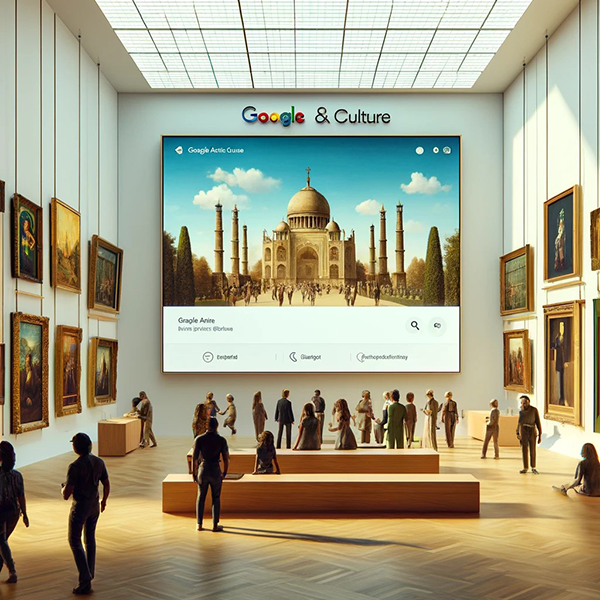
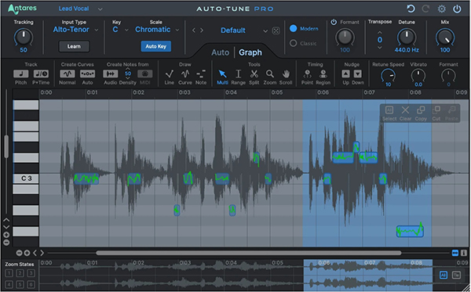

# PEC3: Visionando el futuro con las gafas de Manovich 

## Recurso de aprendizaje de Cultura Digital 
> *[Google Arts & Culture](https://artsandculture.google.com/) y [Autotune](https://www.antarestech.com/es) a través de la mirada de Manovich*

###### ***Autor:*** Pedro José Encinas Mateos

###### ***Fecha:*** 16/05/2024

## INTRODUCCIÓN

> "La hibridación no es tan solo la suma mecánica de las partes existentes previamente, sino una nueva «especie»: un nuevo tipo de estética visual que no existía antes." 
Manovich, L. (2013). *El software toma el mando*. UOC.

La hibridación de medios, según Manovich, implica combinar técnicas, formatos de representación, y nuevas técnicas de manipulación de datos exclusivas del ordenador para crear nuevas combinaciones de medios que no eran posibles antes de su conversión a software. ​Manovich, L. (2013). *El software toma el mando*. UOC.
Esta hibridación de los medios tradicionales ha producido una profunda transformación facilitándonos la forma en como interactuamos con la cultura y el arte, lo que ha llevado a impulsar una convergencia entre los medios tradicionales y las nuevas tecnologías. 

Una hibridación de medios se puede reconocer por la combinación de propiedades y técnicas de diferentes medios anteriores, que se interrelacionan para formar nuevos híbridos. Estos no son simplemente una suma de sus partes, sino entidades completamente nuevas que aprovechan las capacidades del software para integrar y reconfigurar sus componentes de manera innovadora​. ​Manovich, L. (2013). *El software toma el mando*. UOC.

Dos ejemplos son Google Arts & Culture y el uso de Autotune en la industria musical.

En el caso de Google Arts & Culture transforma completamente la forma de realizar visitas a los museos, permitiendo que el arte sea accesible a todos los niveles mediante la digitalización de alta calidad de las obras o las vistas interactivas de museos famosos. 

Por otro lado, Autotune ha revolucionado la industria permitiendo a los artistas manipular y afinar sus voces como nunca obteniendo correcciones sutiles de la voz o consiguiendo grandes efectos vocales. 

## GOOGLE ARTS & CULTURE: EL ARTE AL ALCANCE DE LA MANO

> "En efecto, es posible concebir la multimedia como un caso particular de medios híbridos. Sin embargo, prefiero verla realmente como un solapamiento de dos fenómenos distintos."
Manovich, L. (2013). *El software toma el mando*. UOC.

Google Arts & Culture hibrida imágenes de alta resolución de obras de arte tradicional con tecnología digital avanza proporcionadas por tecnologías de visualización en 3D y realidad aumentada. Permite a los usuarios explorar detalles que serían difíciles de ver a simple vista y proporciona un contexto histórico y cultural que enriquece la experiencia.
También colabora con artistas y científicos, utilizando tecnologías como la inteligencia artificial para crear experiencias educativas e inmersivas. Esta combinación ofrece una nueva forma de interacción cultural que trasciende lo físico y lo digital.

#### Revolución

Esto permite convertir obras de arte físicas en información digital con una alta resolución. Las pinturas, esculturas o documentos se digitalizan permitiendo una reproducción precisa y detallada para su consulta. Esta representación numérica preserva las obras permitiendo su estudio y evitando el deterioro de estas, acción que permite a los usuarios acercarse hasta el más mínimo detalle de cada obra, algo que en una visita física seria inimaginable. Esta posibilita y transforma la forma de explorar y disfrutar del arte, así como la interactuación con las obras que a la larga permite un entendimiento más profundo y enriquecedor de la experiencia.

Google Arts & Culture permite organizar el contenido de forma independiente según el tipo de contenido lo que puede permitir experiencias personalizadas en cada visita. 

De esta forma los usuarios pueden elegir disfrutar la obra de un solo artista o explorar una colección determinada de obras según sus preferencias lo que permite una flexibilidad durante la visita dando libertad al usuario en su experiencia.

Una funcionalidad de Google Arts&Culture es Art Selfie que utiliza las tecnologías avanzadas disponibles hoy en día como puede ser la inteligencia artificial que facilita la experiencia del usuario y la fotografía tradicional permitiéndonos descubrir las obras de arte de forma divertida. Esta interacción con el arte es más lúdica y atractiva y además personaliza y enriquece la experiencia del usuario. Los algoritmos utilizados por la inteligencia artificial pueden realizar recomendaciones o sugerir obras y colecciones basadas en las preferencias del usuario, creando un recorrido cultural personalizado.

Cuando se realiza la transformación de las obras de arte en datos digitales se permite reinterpretar el arte y la cultura, ofreciendo nuevas formas de interactuar y entender las obras. La digitalización de las colecciones facilita el acceso al arte por parte de los usuarios de cualquier parte del mundo. Esta representación del arte dentro del mundo digital facilita una nueva forma de aprendizaje y apreciación del arte y la cultura, integrando elementos interactivos y multimedia para enriquecer la experiencia educativa.

----

## AUTOTUNE: LA VOZ DIGITAL EN LA MÚSICA MODERNA

#### Hibridación

> "La hibridación no es tan solo la suma mecánica de las partes existentes previamente, sino una nueva «especie»: un nuevo tipo de estética visual que no existía antes."
Manovich, L. (2013). *El software toma el mando*. UOC.

Autotune es una herramienta software que ha revolucionado el mundo de la producción musical, ejemplificando una hibridación que fusiona técnicas tradicionales de canto vocal con la producción musical utilizando tecnologías digitales avanzadas transformando la creación de la música. 

La hibridación de medios en el Autotune combina la interpretación vocal tradicional con tecnología digital avanzada obteniendo una manipulación precisa. Este software ajusta la afinación de la voz del cantante en tiempo real, corrigiendo las notas para que coincidan con la escala musical deseada. Así, Autotune fusiona las habilidades humanas de canto con algoritmos digitales. Cuando se transforma la voz en datos digitales y editables se facilita la corrección de los errores en la voz y se consigue la creación de efectos vocales únicos, creando un híbrido que redefine la producción musical moderna al permitir correcciones y efectos vocales que no se podrían lograr únicamente con técnicas tradicionales.

Así los artistas y los productores musicales pueden realizar un proceso de perfeccionamiento en la interpretación de cada nota aportando a los músicos la posibilidad de experimentar con diferentes estilos y efectos dentro de una misma pista.

La aplicación puede corregir automáticamente el tono de una voz en tiempo real, eliminando la necesidad de complicados ajustes manuales. Esta automatización además de ahorrar tiempo durante la producción también garantiza un nivel de consistencia y precisión que difícilmente se lograría manualmente. Otra ventaja sería permitir a los artistas concentrarse más en la interpretación y la creatividad ya que la tecnología se va a encargar de la corrección de los posibles errores.

### Referencias y Bibliografía

* Manovich, Lev. (2013). **El Software toma el mando**. Barcelona: Editorial UOC.
  
* Arte TV. **Autotune, el photoshop de la voz.** [Descúbrelo aquí](https://www.arte.tv/es/videos/104734-001-A/auto-tune-el-photoshop-de-la-voz-1-6/)

* Isaza, Miguel. (17 de diciembre de 2022). **La historia de Auto-Tune: de la geofísica a la música cibernética.** [Descúbrelo aquí](https://www.hispasonic.com/reportajes/historia-creacion-auto-tune-geofisica-revolucion-musical-siglo-xxi/43371)
    
* Londoño, Camila. (03 de agosto de 2017). **Google Arts & Culture: una forma innovadora de trabajar el arte y la historia en el aula.** [Descúbrelo aquí](https://eligeeducar.cl/ideas-para-el-aula/google-arts-culture-una-forma-innovadora-de-trabajar-el-arte-y-la-historia-en-el-aula/)
  
* Iurisdoc.com. **Google Arts & Culture: ¿quién dice que el arte no interesa?.** [Descúbrelo aquí](https://www.iurisdoc.com/es/google-arts-culture-quien-dice-que-el-arte-no-interesa/)

* Fernández, Yubal. (25 de enero de 2024). **Art Selfie 2: cómo generar tu selfie basado en obras de arte con la inteligencia artificial de Google** [Descúbrelo aquí](https://www.xataka.com/basics/art-selfie-2-como-generar-tu-selfie-basado-obras-arte-inteligencia-artificial-google)

----

###### *Licencia: Material Creative Commons desarrollado bajo licencia CC BY-SA 4.0.* 
###### *Imágenes generadas por IA, propiedad del autor del artículo.*
