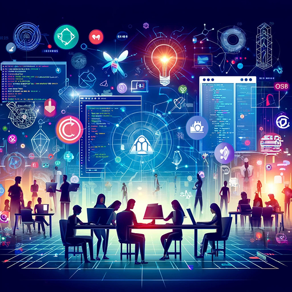
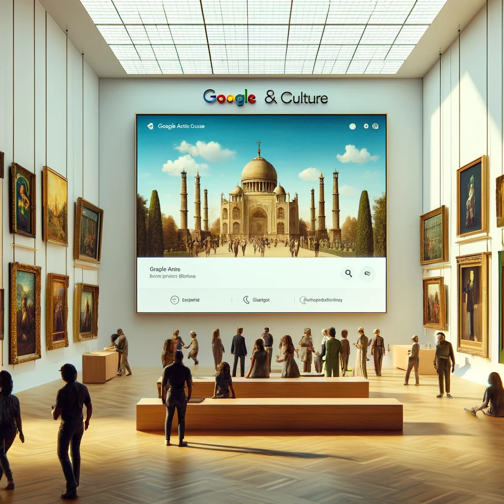

# PEC3: Visionando el futuro con las gafas de Manovich 

## Recurso de aprendizaje de Cultura Digital 
> **[Google Arts & Culture](https://artsandculture.google.com/) y [Autotune](https://www.antarestech.com/es) a través de la mirada de Manovich**

###### ***Autor:*** Pedro José Encinas Mateos

###### ***Fecha:*** 16/05/2024

## INTRODUCCIÓN

La hibridación de los medios tradicionales ha producido una profunda transformación facilitándonos la forma en como interactuamos con la cultura y el arte, lo que ha llevado a impulsar una convergencia entre los medios tradicionales y las nuevas tecnologías. 

Dos ejemplos de esta hibridación son Google Arts & Culture y el uso de Autotune en la industria musical. Ambos nos enseñan como las formas tradicionales de creación y consumo cultural han variado con el avance del software y los medios. 

En el caso de Google Arts & Culture transforma completamente la forma de realizar visitas a los museos, permitiendo que el arte sea accesible a todos los niveles mediante la digitalización de alta calidad de las obras o las vistas interactivas de museos famosos. 

Por otro lado, Autotune ha revolucionado la industria permitiendo a los artistas manipular y afinar sus voces como nunca obteniendo correcciones sutiles de la voz o consiguiendo grandes efectos vocales. 
Ambos ejemplos no solo demuestran la aplicación de los principios de Manovich, sino que también plantean preguntas sobre la autenticidad, la creatividad y la experiencia estética en la era digital.

## GOOGLE ARTS & CULTURE: EL ARTE AL ALCANCE DE LA MANO

Google Arts & Culture consigue integrar la tecnología disponible hoy en día con el arte y la cultura lo que nos permiten poder disfrutar de una experiencia única y accesible para todos los usuarios. En él se redefine la forma de acceso y la interacción con la cultura.

#### Revolución

Esto permite convertir obras de arte físicas en información digital con una alta resolución. Las pinturas, esculturas o documentos se digitalizan permitiendo una reproducción precisa y detallada para su consulta. Esta representación numérica preserva las obras permitiendo su estudio y evitando el deterioro de estas, acción que permite a los usuarios acercarse hasta el más mínimo detalle de cada obra, algo que en una visita física seria inimaginable. Esta posibilita y transforma la forma de explorar y disfrutar del arte, así como la interactuación con las obras que a la larga permite un entendimiento más profundo y enriquecedor de la experiencia.

Google Arts & Culture permite organizar el contenido de forma independiente según el tipo de contenido lo que puede permitir experiencias personalizadas en cada visita. 

De esta forma los usuarios pueden elegir disfrutar la obra de un solo artista o explorar una colección determinada de obras según sus preferencias lo que permite una flexibilidad durante la visita dando libertad al usuario en su experiencia.

Una funcionalidad de Google Arts&Culture es Art Selfie que utiliza las tecnologías avanzadas disponibles hoy en día como puede ser la inteligencia artificial que facilita la experiencia del usuario. Art Selfie permite descubrir las obras de arte de forma divertida. Esta interacción con el arte es más lúdica y atractiva y además personaliza y enriquece la experiencia del usuario. Los algoritmos utilizados por la inteligencia artificial pueden realizar recomendaciones o sugerir obras y colecciones basadas en las preferencias del usuario, creando un recorrido cultural personalizado.

Estas experiencias personalizadas únicas podrían dar la posibilidad a cada usuario de explorar el arte por temáticas, épocas, estilos o incluso por los colores dominantes en cada obra. Esta capacidad en la variabilidad asegura que cada visita a Google Arts & Culture pueda ser distinta, proporcionando siempre algo nuevo que descubrir.

Cuando se realiza la transformación de las obras de arte en datos digitales se permite reinterpretar el arte y la cultura, ofreciendo nuevas formas de interactuar y entender las obras. La digitalización de las colecciones facilita el acceso al arte por parte de los usuarios de cualquier parte del mundo. Esta representación del arte dentro del mundo digital facilita una nueva forma de aprendizaje y apreciación del arte y la cultura, integrando elementos interactivos y multimedia para enriquecer la experiencia educativa.

#### Ventajas

1. Accesibilidad al Arte: Facilita el acceso a obras de arte y patrimonio cultural desde cualquier lugar.
2. Educación Visual: Ofrece recursos educativos visuales e interactivos para el aprendizaje del arte y la historia.
3. Preservación Digital: Ayuda en la preservación digital de obras de arte, asegurando su disponibilidad para futuras generaciones

## AUTOTUNE: LA VOZ DIGITAL EN LA MÚSICA MODERNA

#### Hibridación

Autotune es una herramienta software que ha revolucionado el mundo de la producción musical, ejemplificando una hibridación que fusiona técnicas tradicionales de canto vocal con la producción musical utilizando tecnologías digitales avanzadas transformando la creación de la música. 

Autotune permite modificar y transformar la voz humana obteniendo una manipulación precisa. Este proceso es esencial para ajustar el tono y la afinación de las voces grabadas. Cuando se transforma la voz en datos digitales y editables se facilita la corrección de los errores en la voz y se consigue la creación de efectos vocales únicos. Esta capacidad de digitalización mejora la calidad de las grabaciones y también permite a los artistas experimentar con sonidos nuevos que antes eran inalcanzables para su voz.

Autotune tiene la capacidad de tratar cada nota y fragmento grabado como partes independientes que pueden ser ajustadas individualmente. Los productores musicales pueden aislar y modificar determinadas partes específicas de una grabación sin afectar el resto. Esto permite una mayor precisión y control de la producción y edición musical. 

Así los artistas y los productores musicales pueden realizar un proceso de perfeccionamiento en la interpretación de cada nota aportando a los músicos la posibilidad de experimentar con diferentes estilos y efectos dentro de una misma pista.

La aplicación puede corregir automáticamente el tono de una voz en tiempo real, eliminando la necesidad de complicados ajustes manuales. Esta automatización además de ahorrar tiempo durante la producción también garantiza un nivel de consistencia y precisión que difícilmente se lograría manualmente. Otra ventaja sería permitir a los artistas concentrarse más en la interpretación y la creatividad ya que la tecnología se va a encargar de la corrección de los posibles errores.

Autotune dispone de una amplia gama de efectos vocales que pueden ser aplicables a la voz del artista. Esto permite tanto correcciones sutiles poco perceptibles como efectos robóticos. Los artistas pueden ajustar la configuración de Autotune para crear diferentes atmósferas y estilos en sus canciones, adaptándose a diversos géneros musicales. Estas posibles variaciones en la interpretación permiten una experimentación continua, ampliando las posibilidades de interpretación de la voz humana.Esto nos lleva a una transcodificación cultural que se ve reflejada en la percepción del proceso de la producción de la música dando la sensación de que la interpretación vocal está al alcance de cualquier persona que disponga de este software incluso disponible en modo online.  La tecnología no solo ha influido en cómo se produce la música, sino también en cómo es consumida y en la valoración que se realiza de la misma, generando debates sobre la autenticidad y el talento en los artistas. Sin embargo, muchos artistas lo consideran una herramienta creativa que expande las posibilidades en la música. Esta dualidad redefine las costumbres del mercado musical.

#### Ventajas

1. Mejora Vocal: Permite a cantantes ajustar y mejorar sus voces, produciendo interpretaciones más precisas.
2. Creatividad Musical: Facilita la experimentación con efectos vocales, ampliando las posibilidades creativas en la música.
3. Accesibilidad Musical: Hace que la producción musical de alta calidad sea accesible para músicos aficionados y profesionales.

### Referencias y Bibliografía

* Manovich, Lev. (2013). **El Software toma el mando**. Barcelona: Editorial UOC.
  
* Arte TV. **Autotune, el photoshop de la voz.** [Descúbrelo aquí](https://www.arte.tv/es/videos/104734-001-A/auto-tune-el-photoshop-de-la-voz-1-6/)

* Isaza, Miguel. (17 de diciembre de 2022). **La historia de Auto-Tune: de la geofísica a la música cibernética.** [Descúbrelo aquí](https://www.hispasonic.com/reportajes/historia-creacion-auto-tune-geofisica-revolucion-musical-siglo-xxi/43371)
    
* Camila Londoño. (03 de agosto de 2017). **Google Arts & Culture: una forma innovadora de trabajar el arte y la historia en el aula.** [Descúbrelo aquí](https://eligeeducar.cl/ideas-para-el-aula/google-arts-culture-una-forma-innovadora-de-trabajar-el-arte-y-la-historia-en-el-aula/)
  
* Iurisdoc.com. **Google Arts & Culture: ¿quién dice que el arte no interesa?.** [Descúbrelo aquí](https://www.iurisdoc.com/es/google-arts-culture-quien-dice-que-el-arte-no-interesa/)

----

###### *Licencia: Material Creative Commons desarrollado bajo licencia CC BY-SA 4.0.* 
###### *Imágenes generadas por IA, propiedad del autor del artículo.*
